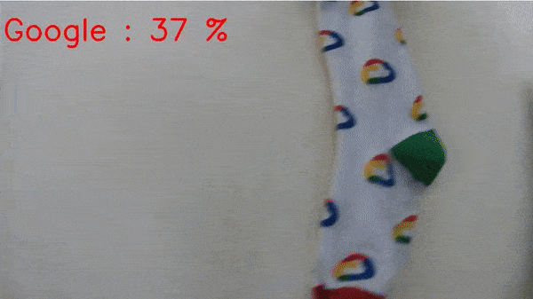
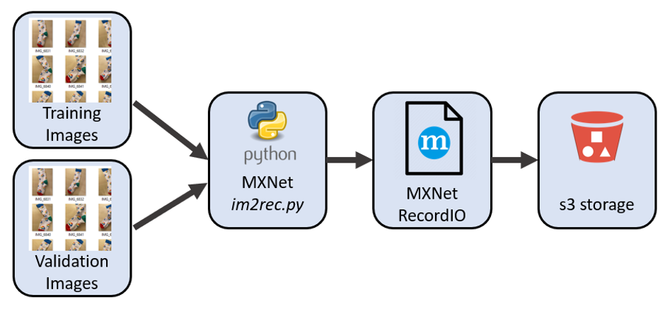
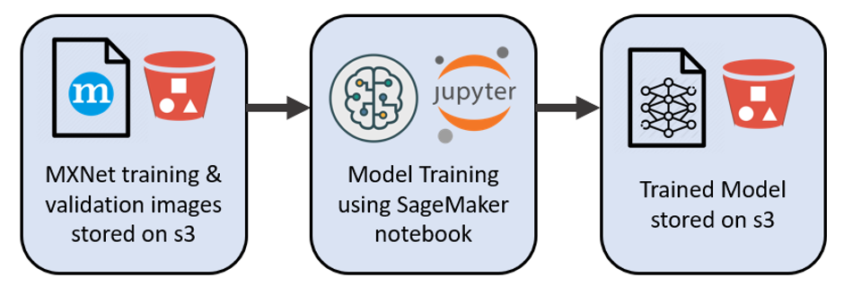
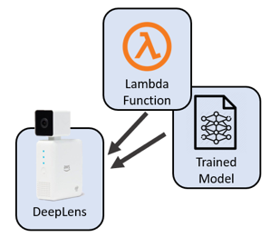
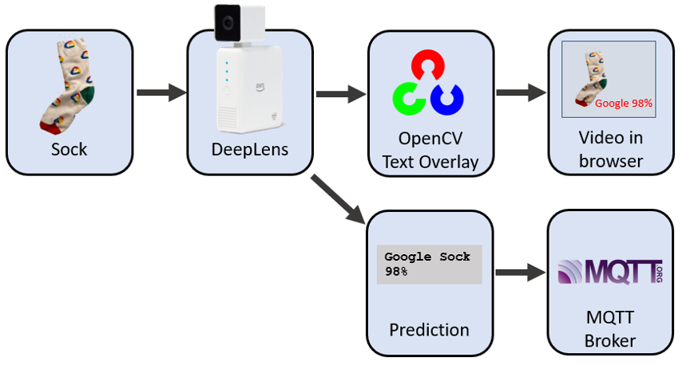
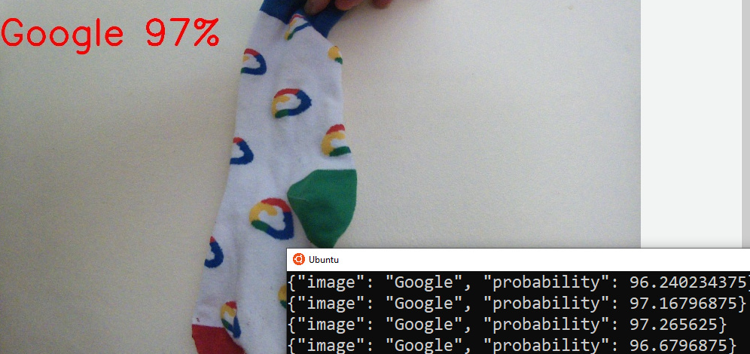
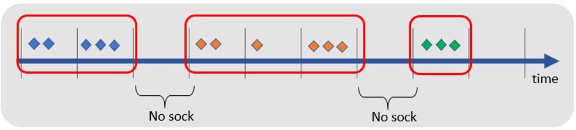

# Sock Sort

## Description 

Sort socks into pairs using deep learning image classification and Kafka stream processing




## Image Preparation



Prepare a dataset of sock images in ImageRecord format.  Further references [here](https://gluon-cv.mxnet.io/build/examples_datasets/recordio.html) and [here](https://arthurcaillau.com/image-record-iter/)

First, we need to generate a `.lst` file, i.e. a list of these images containing label and filename information.


```
cd 10-image-preparation
```

Setup Python and download im2rec.py
```
python3 -m venv myenv
source myenv/bin/activate
pip install mxnet opencv-python
curl --output im2rec.py https://raw.githubusercontent.com/apache/incubator-mxnet/master/tools/im2rec.py
```


Remove any existing files
```
rm -f *.lst *.rec *.idx
```

Create dataset of sock images in ImageRecord format
```
python im2rec.py --list  --train-ratio 0.8   --recursive ./sock-images_rec sock-images/
```

Gives 
```
class-confluent 0
class-databricks 1
class-github 2
class-google 3
class-mongo 4
class-streamset 5
```

After the execution, you find files `sock-images_rec_train.lst` and `sock-images_rec_val.lst` generated. 

```
wc -l *.lst
544 sock-images_rec_train.lst
137 sock-images_rec_val.lst
681 total
```  

With this file, the next step is:

```
python im2rec.py   --resize 512   --center-crop   --num-thread 4 ./sock-images_rec ./sock-images/
```


It gives you four more files: (`sock-images_rec_train.idx`, `sock-images_rec_train.rec`, `sock-images_rec_val.idx`, `sock-images_rec_val.rec`). Now, you can use them to train!

```
 aws s3 cp . s3://deeplens-sagemaker-socksort --exclude "*" --include "*.idx"  --include "*.rec"  --include "*.lst" --recursive
```


# Model Training



Now we want to train an image classification model that can classify sock images.  We will use transfer learning mode using AWS Sagemaker.  We can launch a Sagemaker notebook for image classification algorithm in transfer learning mode to fine-tune a pre-trained model (trained on sock images data) to learn to classify a new dataset.  A more extensive explanation  [here](https://github.com/awslabs/amazon-sagemaker-examples/blob/master/introduction_to_amazon_algorithms/imageclassification_caltech/Image-classification-transfer-learning-highlevel.ipynb)

The steps here are 
* Import the sock dataset as a _recordio_ format.
* Build an image classification model
* Deploy a temporary classifier to test the inference function
* Test a few demonstration images can be correctly classified

### Download test image and Evaluate

* Navigate to https://console.aws.amazon.com/sagemaker
* Create a new notebook instance
* Open `20-model-training/sock-classification.ipynb` as a new notebook file
* Execute the cells

All going well you should have a model file 
`${S3_BUCKET}/ic-transfer-learning/output/image-classification-${DATE}/output/model.tar.gz`


# Deeplens Lambda Function




Now to the the Deeplens Greengrass Lambda Function.  That is, we need to build, publish and deploy the Sock Sort AWS DeepLens Inference Lambda Function

Steps to build `sock_deeplens_inference_function.zip`

```
cd 30-deeplens-greengrass-lambda
mkdir package_deeplens_inference_function
pip install --target ./package_deeplens_inference_function paho-mqtt
cd package_deeplens_inference_function
wget https://docs.aws.amazon.com/deeplens/latest/dg/samples/deeplens_inference_function_template.zip
unzip deeplens_inference_function_template.zip
rm deeplens_inference_function_template.zip
cp ../deeplens_inference.py	.
cp ../sock_labels.txt .
cp ../mqttconfig.py . # optional
zip -r9 ${OLDPWD}/sock_deeplens_inference_function.zip .
cd ..
ls  sock_deeplens_inference_function.zip
```

## Load object classification model to DeepLens
To transfer the object classification model in SageMaker and import it to DeepLens follow these [instructions](https://aws.amazon.com/blogs/machine-learning/build-your-own-object-classification-model-in-sagemaker-and-import-it-to-deeplens/)

## Publish Sock Sort AWS DeepLens Inference Lambda Function
See [here](https://docs.aws.amazon.com/deeplens/latest/dg/deeplens-inference-lambda-create.html) for a step by step guide 

# Testing



Open a browser and navigate to `https://<local-ip-address-of-deep-lens>:4000/`





# Sock Stream Sorting using ksqlDB and Kafka


## Load MQTT into Kafka using Kafka Connect


# ksqlDB Stream Processing

## Kafka Connect MQTT Source into Kafka
Our next task is to stream the sock identification messages from MQTT into Kafka

```
docker-compose up -d
```


## TEST MQTT
```
mosquitto_sub -h ${MQTT_HOST} -p ${MQTT_PORT} -u ${MQTT_USER} -P ${MQTT_PASS} -t sockfound
```

```
{"image": "Blank", "probability": 37.59765625}
{"image": "Blank", "probability": 41.162109375}
{"image": "Google", "probability": 97.314453125}
{"image": "Google", "probability": 94.970703125}
{"image": "Google", "probability": 64.6484375}
{"image": "Blank", "probability": 67.3828125}
{"image": "Blank", "probability": 50.634765625}
{"image": "Running Science", "probability": 33.69140625}
{"image": "Running Science", "probability": 51.806640625}
```


## Connect
List available plugs - ensure MQTT is visible 
```
curl -s -X GET http://localhost:8083/connector-plugins | jq '.'
```

Amongst other drivers you'll want to see
```
  . . . 
    "class": "io.confluent.connect.mqtt.MqttSourceConnector",
    "type": "source",
    "version": "0.0.0.0"
  . . . 
```  

## ksqlDB CLI
```
docker-compose exec ksql-cli ksql http://ksql-server:8088
```


## Kafka Connect via ksqlDB

```
CREATE SOURCE CONNECTOR `mqtt-source` WITH(
    "connector.class"='io.confluent.connect.mqtt.MqttSourceConnector',
    "mqtt.server.uri"='${file:/scripts/credentials.properties:MQTT_URI}',
    "mqtt.username"='${file:/scripts/credentials.properties:MQTT_USERNAME}',
    "mqtt.password"='${file:/scripts/credentials.properties:MQTT_PASSWORD}',
    "mqtt.topics"='sockfound',
    "kafka.topic"='data_mqtt',
    "key.converter"='org.apache.kafka.connect.storage.StringConverter',
    "value.converter"='org.apache.kafka.connect.converters.ByteArrayConverter',
    "tasks.max"='1',
    "confluent.topic.bootstrap.servers"='kafka:29092',
    "confluent.topic.replication.factor"='1'
);
```

## Kafka
Check incoming records
```
kafka-console-consumer --bootstrap-server localhost:9092 --topic data_mqtt --from-beginning
```

All going well you'll see payloads like this
```
{"image": "Running Science", "probability": 43.994140625}
{"image": "Mongo", "probability": 50.29296875}
{"image": "Mongo", "probability": 86.279296875}
{"image": "Mongo", "probability": 53.076171875}
```





But in realatity


```
-- Creata stream for the MQTT topic
create stream sock_stream(image varchar, probability double) 
with (kafka_topic='data_mqtt',  value_format='json');

-- Bucket sock images into windows of 5 seconds
create table sock_stream_smoothed as
select image
, timestamptostring(windowstart(), 'hh:mm:ss') as last_seen
, windowstart() as window_start
from sock_stream
window tumbling (size 5 seconds)
where image != 'blank'
group by image having count(*) > 3
emit changes;

-- Find pairs of socks (socks appearing in even numbers)
select image
, case when (count(*)/2)*2 = count(*) then 'Pair' else 'Un-matched' end  as pair_seen
, count(*) as number_socks_seen
from sock_stream_smoothed 
group by image 
emit changes;
```